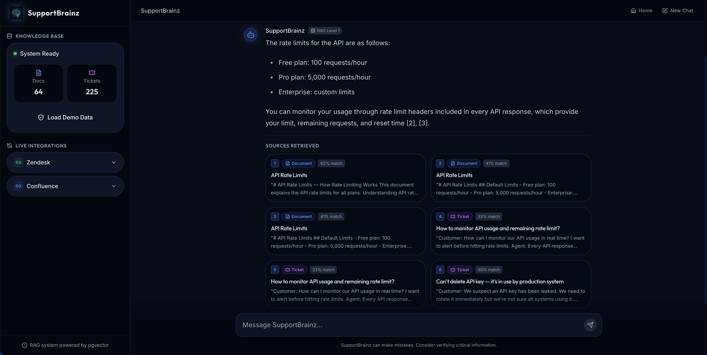

# SupportBrainz

SupportBrainz is an AI-powered customer support assistant that helps support teams answer tickets faster and more consistently. Instead of searching through wikis and old tickets manually, you ask a question in natural language and get a synthesised answer drawn directly from your knowledge base and ticket history — with numbered citations linking back to every source used.



---

## What it can help you with

- **Answer incoming support tickets** — paste a customer's question and get a draft answer grounded in your documentation
- **Search your knowledge base conversationally** — no Boolean queries, just plain English
- **Surface relevant past tickets** — find how similar issues were resolved before
- **Onboard new support agents** — point them at SupportBrainz instead of dozens of wiki pages
- **Reduce escalations** — common questions are answered instantly, freeing senior staff for edge cases

---

## Features

| Feature | Description |
|---|---|
| RAG-powered answers | Every answer is generated from retrieved documents and tickets, not from model memory |
| Numbered citations | Inline `[1]` `[2]` `[3]` markers match source cards below the answer |
| Full source viewer | Click any citation card to read the complete document or ticket in a modal |
| Suggested questions | Four ready-made queries on the welcome screen to explore the knowledge base |
| Demo data loader | One-click seed of 25 knowledge-base documents and 30 support tickets with neural embeddings |
| Zendesk integration | Connect a Zendesk subdomain and API key to import live tickets |
| Confluence integration | Connect a Confluence space to pull in documentation pages |
| New Chat | Clear the conversation and return to the welcome screen at any time |
| Dark UI | Full dark-mode chat interface built for all-day use |

---

## Tech stack

### RAG (Retrieval-Augmented Generation)

RAG is the core architecture of the application. When a user submits a query, the system does not ask the LLM to answer from memory. Instead it:

1. **Embeds** the query into a 384-dimensional vector using the `BAAI/bge-small-en-v1.5` model (via fastembed, runs on CPU with ONNX runtime)
2. **Retrieves** the most semantically similar documents and tickets from PostgreSQL using pgvector cosine similarity
3. **Evaluates** whether the retrieved context is sufficient to answer the question (via LLM call)
4. **Generates** an answer grounded in that context, or **refines** the query and re-retrieves if the context was insufficient (one automatic retry)
5. **Returns** the answer alongside numbered citations pointing to every source used

This guarantees that answers are traceable and hallucinations are minimised, since the LLM is constrained to the retrieved content.

---

### pgvector

pgvector is a PostgreSQL extension that adds vector storage and similarity search. Every document and ticket is stored in PostgreSQL alongside its 384-dimensional embedding vector. When a query arrives, its embedding is compared against all stored vectors using cosine distance — the closest matches are the most semantically relevant items, regardless of exact keyword overlap. An IVFFlat index keeps retrieval fast as the knowledge base grows.

---

### LangChain

LangChain is used for building the prompt chains within the RAG pipeline. Each step (evaluate, refine, generate) uses a `ChatPromptTemplate` composed with the LLM and a `StrOutputParser` via LangChain Expression Language (LCEL). This makes it straightforward to swap models or change prompting strategies without touching the graph logic.

---

### LangGraph

LangGraph is a library for building stateful, graph-based workflows on top of LangChain. It models the RAG pipeline as an explicit state machine:

```
retrieve → evaluate → generate (if context is sufficient)
                   → refine → generate (if context needs improvement)
```

Each node is a Python function that receives the current `RAGState` (a typed dict containing query, embedding, citations, context, answer, and metadata) and returns a partial update to that state. The conditional edge after `evaluate` routes to either `generate` or `refine` depending on whether the LLM judged the context sufficient. This makes the retry logic explicit, testable, and easy to extend.

---

### LangSmith

LangSmith is a tracing and observability platform for LLM applications. Every chat query produces a full trace in the LangSmith dashboard showing the complete pipeline — embeddings, vector searches, LLM calls, token counts, and latencies — all nested under a single root span.

Tracing is configured entirely through environment variables (set as Replit secrets):

| Variable | Value |
|---|---|
| `LANGSMITH_API_KEY` | A workspace-scoped API key from your LangSmith account |
| `LANGSMITH_TRACING` | `true` |
| `LANGSMITH_ENDPOINT` | `https://api.smith.langchain.com` (US) or `https://eu.api.smith.langchain.com` (EU) |
| `LANGSMITH_PROJECT` | `supportbrainz` (or any project name you created in LangSmith) |

The SDK (v0.7.x+) reads these `LANGSMITH_*` variables natively — no additional code configuration is required.

In addition, each key function in `rag.py` is decorated with `@traceable` to produce named spans in the trace tree:

| Function | Span type |
|---|---|
| `embed_text` | `embedding` — fastembed_bge_small |
| `retrieve_similar` | `retriever` — pgvector_similarity_search |
| `retrieve_node` | `retriever` — full retrieve step |
| `evaluate_node` | `llm` — context sufficiency check |
| `refine_node` | `chain` — query refinement + re-retrieval |
| `generate_node` | `llm` — answer generation |
| `run_rag` | `chain` — top-level pipeline |

**Note on API keys:** Create a workspace-scoped key in LangSmith (Settings → API Keys). Do not set `LANGSMITH_WORKSPACE_ID` — the SDK resolves the workspace from the key automatically. Setting it to any value other than your workspace UUID will cause authentication failures.

---

### fastembed

fastembed is a lightweight Python library for generating text embeddings using ONNX Runtime, without requiring PyTorch or CUDA. It downloads the `BAAI/bge-small-en-v1.5` model (~67MB) on first run and produces 384-dimensional embeddings matching the database schema. Embeddings run on CPU and take ~10ms per text on a typical Replit instance.

---

### Python / FastAPI

The backend is written in Python using FastAPI, a high-performance ASGI web framework. Endpoints are served by uvicorn (no hot-reload, so a full workflow restart is needed after code changes). All database access uses psycopg2 with PostgreSQL connection pooling. Blocking operations (embedding generation, LangGraph execution) run in a thread pool executor so the async event loop is not blocked.

---

### React

The frontend is a React single-page app built with Vite. It calls the FastAPI backend over HTTP and renders the chat interface, sidebar, citation cards, and citation modals. The UI is styled with Tailwind CSS and shadcn/ui components.

---

### Replit AI Integration

LLM calls go through Replit's AI Integrations proxy, which provides OpenAI-compatible access without requiring the user to supply their own API key. The model used is **`gpt-5-mini`**, called via LangChain's `ChatOpenAI` client for the evaluate, refine, and generate steps. The proxy is available at `http://localhost:1106/modelfarm/openai` and is configured via the `AI_INTEGRATIONS_OPENAI_BASE_URL` environment variable.

---

## Project structure

```
artifacts/
  api-server/          Python FastAPI backend
    app.py             FastAPI app, all endpoints
    rag.py             LangGraph RAG workflow (retrieve→evaluate→refine→generate)
    seed.py            Demo data (25 docs, 30 tickets) + seeding logic
    start.sh           uvicorn startup script

  support-brainz/      React frontend (Vite)
    src/
      components/
        chat/          ChatMessage, CitationCard, CitationModal
        layout/        Sidebar, TopBar
      pages/
        ChatLayout.tsx Main chat page with modal state
      lib/
        api.ts         API client functions

lib/
  db/                  Drizzle ORM schema (documents, tickets tables)
```

---

## Getting started

The app seeds itself on first use. Click **Load Demo Data** in the sidebar to embed 25 knowledge-base documents and 30 support tickets. Once loaded, you can ask questions immediately.

Try these sample queries:
- "How do I reset my password?"
- "What are the API rate limits?"
- "How do I configure SSO integration?"
- "Why am I getting 429 errors?"
